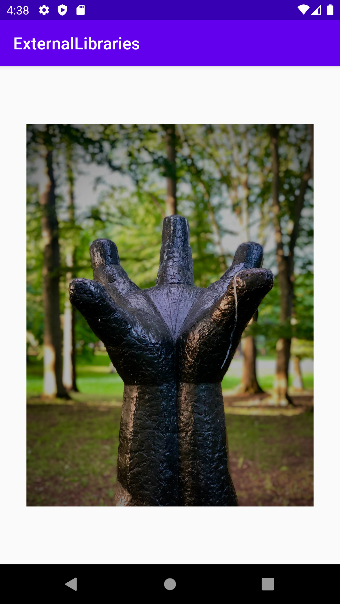

# Rapport

Denna inlämning gick ut på att hämta och använda ett externt bibliotek. I denna app används biblioteket Glide, som underlättar hämtning och lagring av bilder för på ett smidigt och responsivt sätt ladda in bilder. 

För att hämta biblioteket lades följande kodrad till i dependencies objektet i filen *app/build.gradle*:

```gradle
implementation 'com.github.bumptech.glide:glide:4.3.1'
```

Efter detta syncades filen med projektet och bibliotekt var redo att användas i koden. För att hämta en bild och sedan visa den någonstans, lades en ImageView till i layouten för MainActivity. Denna refererades sedan i MainActivity. För att hämta och visa en bild implementerades följande kod i MainActivity#onCreate():

```Java
imageView = findViewById(R.id.main_image); // private ImageView imageView;
Glide.with(this).load(IMAGE_URL).into(imageView);
```

Efter kod ovan kommer appen ladda in bilen på urlen:



[Länk till bild som användes](https://unsplash.com/photos/5CiKuDyFn5k)
